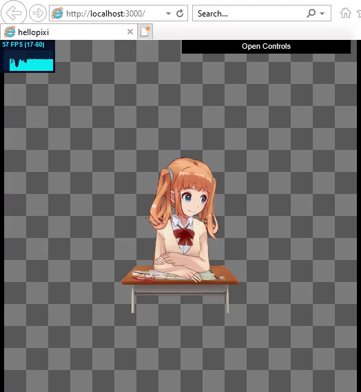

 

# Hello Pixi Dragonbones
*(Also known as: How to use Dragonbones with Pixi5 and Webpack without going insane)*

[]
*(Internet explorer for dramatic purposes)*

## This is meant to be used with Yarn 🐱 
*(however you should be able to use npm)*

### This boilerplate includes:
- PixiJS v5 *(the thing you came for)*
- DragonBones *(the other thing you came for)*
- Typescript *(making javascript a better place)*
- stats.js *(to know how fast are you going)*
- dat.gui *(to make the cool demo selector)*
- Webpack *(will make all your code into an ugly ball)*
  - Webpack Dev Server *(will host said ugly ball to debug locally)*
  - HTML Webpack Plugin *(will help your code have an index.html)* 
  - Copy Webpack Plugin *(will copy your assets to your build)*
- ESLint *(will force your code to be pretty)*
  - ESLint Typescript *(will make ESLint actually work for typescript)*
  - ESLint Prettier *(will force your code to be prettier!)*
- .gitIgnore and .gitAttributes *(my paranoid approach to configuring git)*

## How to use:

**Step 0:** Get Yarn (classic). https://classic.yarnpkg.com/lang/en/  
Honestly I don't know exactly why it is better than npm but it has a cute kitty, I am sold

**Step 1:** Clone the repo (or download as ZIP)

**Step *1.5:*** If you cloned the repo, detach yourself (delete the .git folder).

**Step 2:** Run `yarn install` (or if you are a rebel, `npm install`)

**You are done**  

Now you can run `yarn run test` to build, start watching your source code (rebuilds when you save) open a `localhost:3000` server so you can test in your own browser!

Try `yarn run build` to make a build in a folder called `build`. You can cut this folder since your assets were copied from your assets folder. No more keeping your assets in the dist folder like a caveman!

Finally, try `yarn run lint` to make your code look prettier.

---

## Major things I learnt:

* Force Webpack to create a `PIXI` global object with this simple trick: `new webpack.ProvidePlugin({ PIXI: 'pixi.js' }),`.
* Original examples used a manually created (and deprecated) `WebGLRenderer`. This uses the integrated renderer in Pixi's `App`.
* Some animations names are reused. `dragonBones.PixiFactory.factory.clear()` will reset the factory allowing for clean loading of the samples.
* For some strange reason, even if you have all the assets preloaded, if you try to render a mesh deforming animation immediately after creation you will crash. Wait a bit and then `addChild` it.
* Somehow, someway, this works in Internet Explorer. I don't know what kind of black magic is this.

---

## Demo Files
The demo files are the one provided by the dragonbones repo.  
Copyright (c) 2012-2018 The DragonBones team and other contributors.  